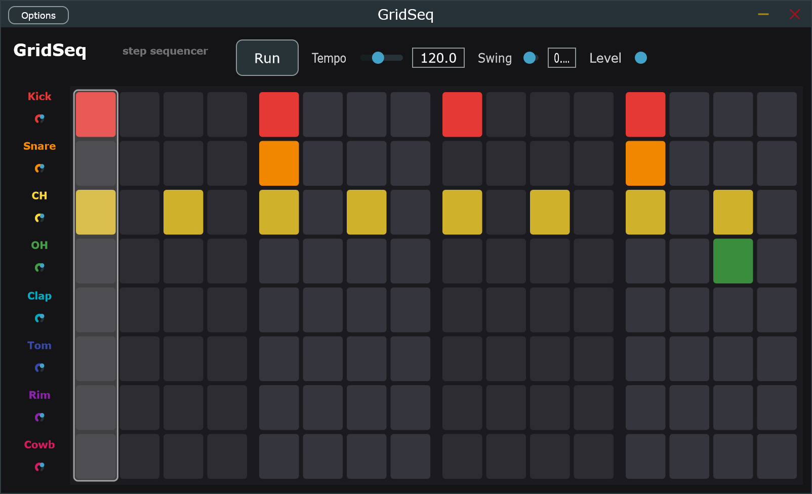

# GridSeq

[](https://github.com/MattBrookPro/GridSeq/actions/workflows/ci.yml)

A small, cross-platform step-sequencer instrument (VST3 + AU) built in JUCE. The
focus of the project is how it is built: the sequencing, timing and voicing
engine is plain C++17 with no dependency on the UI framework, so the musical
core is unit-tested in isolation, runs in CI on Linux, macOS and Windows on every
push, and is cleanly separated from the real-time audio thread that drives it.

An 8-track by 16-step grid drives one procedurally synthesised drum voice per
track, with tempo, swing, per-track gain and a live playhead.



## Why it is built this way

| Concern | Where it lives | Why |
|---|---|---|
| Sequencing, timing, swing, voicing, state | [`engine/`](engine/), pure C++17 | No JUCE, so the logic is testable without an audio device or message loop |
| Behaviour specs (written test-first) | [`tests/`](tests/), Catch2, 29 cases | Link only against the engine; assert hit positions to the sample |
| GUI and plugin formats | [`plugin/`](plugin/), JUCE | A thin, swappable shell over the engine; ships as VST3 and AU |
| QA tooling | [`tools/`](tools/), C++ CLI + Python | Renders the engine offline and checks triggers land sample-accurately |

The keystone is that the engine has no dependency on JUCE. Testability, the
lock-free audio/UI boundary and the cross-platform build all follow from that one
decision.

## Build and test the engine (fast, no JUCE download)

Requires CMake 3.22 or newer and a C++17 compiler.

```bash
cmake -B build -G Ninja
cmake --build build
ctest --test-dir build --output-on-failure
```

## Run the offline render regression check

```bash
python tools/qa_render_check.py
python tools/qa_render_check.py --swing 0.5
```

It renders a pattern through the real engine to a WAV, then verifies every onset
lands on the expected swing-aware 16th-note grid within one sample.

## Build the plugin (downloads JUCE 8)

```bash
cmake -B build -G Ninja -DGRIDSEQ_BUILD_PLUGIN=ON
cmake --build build
```

On Windows, build with MSVC. The helper script finds the Build Tools, imports
their environment, builds, and optionally validates with pluginval:

```powershell
powershell -ExecutionPolicy Bypass -File tools\build-plugin-msvc.ps1 -Validate
```

JUCE on Windows targets MSVC rather than MinGW. On Linux, install JUCE's system
dependencies first (the list is in [`.github/workflows/ci.yml`](.github/workflows/ci.yml)).
The built VST3 passes pluginval (Tracktion's JUCE validator) at strictness level
5, which CI runs on every push.

## Repository layout

```
engine/   pure C++17 core: SequencerEngine, Pattern, SamplerVoice, StateCodec,
          LockFreeFifo, DrumSynth (no JUCE, no UI)
tests/    Catch2 specs: voice, timing, swing, state, lock-free fifo, drum kit
plugin/   JUCE VST3/AU/Standalone: PluginProcessor (glue) + PluginEditor (grid UI)
tools/    gridseq_render (offline WAV renderer) + qa_render_check.py
docs/     TEST_STRATEGY.md and the screenshot
```

## Design highlights

* Drift-free timing. Each step's fire-time is computed from the straight grid
  every block rather than accumulated, so swing and tempo stay locked over long
  playback (there is a 100-bar test proving the downbeats never drift).
* Sample-accurate triggering. `processBlock` renders the block in segments split
  at each trigger, so multiple hits of one monophonic track land at their true
  sample positions instead of collapsing onto the last one.
* Lock-free audio/UI boundary. Continuous parameters cross as atomics; structural
  step edits cross via a single-producer/single-consumer ring with acquire/release
  ordering. Nothing on the audio thread locks or allocates.
* Reproducible, licence-free sounds. The kit is synthesised from a deterministic
  PRNG, so it is bit-identical on every platform and carries no sample licensing.

## Documentation

* [`docs/TEST_STRATEGY.md`](docs/TEST_STRATEGY.md): how the project is tested
  across unit, rendered-output, plugin-validation and acceptance layers.

## License

MIT. See [`LICENSE`](LICENSE).
